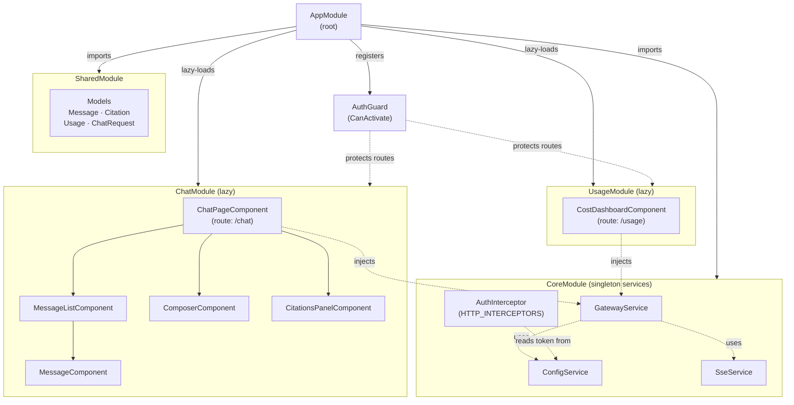

# Angular Module / Component Tree

Angular module and component hierarchy for `atlas-frontend`. Arrows represent
module imports or component containment; dashed arrows denote service provision.

```mermaid
flowchart TD
    AppModule["AppModule\n(root)"]

    subgraph CoreModule["CoreModule (singleton services)"]
        ConfigService["ConfigService"]
        AuthInterceptor["AuthInterceptor\n(HTTP_INTERCEPTORS)"]
        GatewayService["GatewayService"]
        SseService["SseService"]
    end

    subgraph ChatModule["ChatModule (lazy)"]
        ChatPageComponent["ChatPageComponent\n(route: /chat)"]
        MessageListComponent["MessageListComponent"]
        ComposerComponent["ComposerComponent"]
        CitationsPanelComponent["CitationsPanelComponent"]
        MessageComponent["MessageComponent"]
    end

    subgraph UsageModule["UsageModule (lazy)"]
        CostDashboardComponent["CostDashboardComponent\n(route: /usage)"]
    end

    subgraph SharedModule["SharedModule"]
        Models["Models\nMessage · Citation\nUsage · ChatRequest"]
    end

    AppModule -->|imports| CoreModule
    AppModule -->|lazy-loads| ChatModule
    AppModule -->|lazy-loads| UsageModule
    AppModule -->|imports| SharedModule

    ChatPageComponent --> MessageListComponent
    ChatPageComponent --> ComposerComponent
    ChatPageComponent --> CitationsPanelComponent
    MessageListComponent --> MessageComponent

    GatewayService -.->|uses| SseService
    GatewayService -.->|uses| ConfigService
    AuthInterceptor -.->|reads token from| ConfigService

    ChatPageComponent -.->|injects| GatewayService
    CostDashboardComponent -.->|injects| GatewayService

    AuthGuard["AuthGuard\n(CanActivate)"] -.->|protects routes| ChatModule
    AuthGuard -.->|protects routes| UsageModule
    AppModule -->|registers| AuthGuard
```
