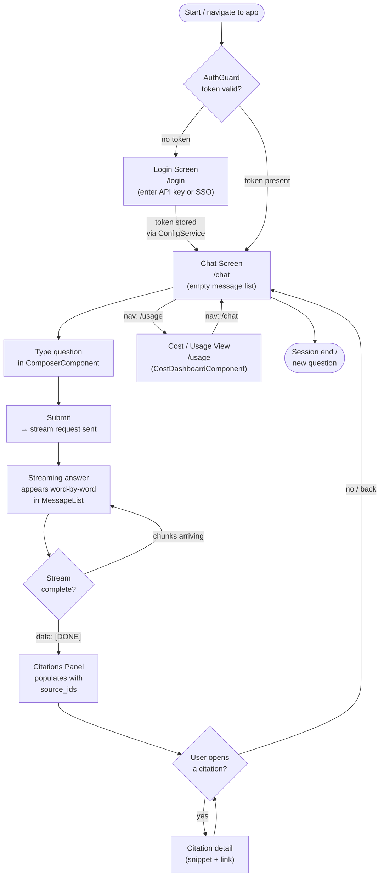

# Screen Wire-Flow

User journey through `atlas-frontend` screens, from authentication to citation
inspection and the cost/usage view.

```mermaid
flowchart TD
    A(["Start / navigate to app"])
    B["Login Screen\n/login\n(enter API key or SSO)"]
    C{"AuthGuard\ntoken valid?"}
    D["Chat Screen\n/chat\n(empty message list)"]
    E["Type question\nin ComposerComponent"]
    F["Submit\n→ stream request sent"]
    G["Streaming answer\nappears word-by-word\nin MessageList"]
    H{"Stream\ncomplete?"}
    I["Citations Panel\npopulates with\nsource_ids"]
    J{"User opens\na citation?"}
    K["Citation detail\n(snippet + link)"]
    L["Cost / Usage View\n/usage\n(CostDashboardComponent)"]
    M(["Session end /\nnew question"])

    A --> C
    C -- "no token" --> B
    B -- "token stored\nvia ConfigService" --> D
    C -- "token present" --> D
    D --> E
    E --> F
    F --> G
    G --> H
    H -- "chunks arriving" --> G
    H -- "data: [DONE]" --> I
    I --> J
    J -- "yes" --> K
    K --> J
    J -- "no / back" --> D
    D -- "nav: /usage" --> L
    L -- "nav: /chat" --> D
    D --> M
```
