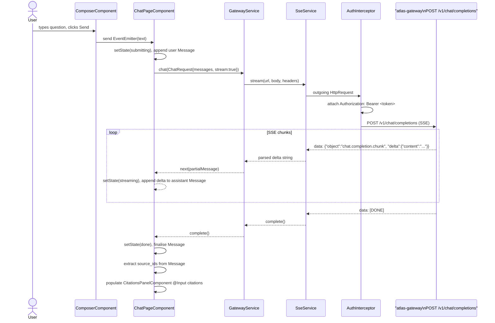

# Frontend ↔ Gateway Sequence

End-to-end sequence for a single chat turn: from user submission through SSE
streaming to final citations render.

```mermaid
sequenceDiagram
    actor User
    participant Composer as ComposerComponent
    participant ChatPage as ChatPageComponent
    participant Gateway as GatewayService
    participant SSE as SseService
    participant Auth as AuthInterceptor
    participant GW as "atlas-gateway\nPOST /v1/chat/completions"

    User->>Composer: types question, clicks Send
    Composer->>ChatPage: send EventEmitter(text)
    ChatPage->>ChatPage: setState(submitting), append user Message
    ChatPage->>Gateway: chat(ChatRequest{messages, stream:true})
    Gateway->>SSE: stream(url, body, headers)
    SSE->>Auth: outgoing HttpRequest
    Auth->>Auth: attach Authorization: Bearer <token>
    Auth->>GW: POST /v1/chat/completions (SSE)

    loop SSE chunks
        GW-->>SSE: data: {"object":"chat.completion.chunk", "delta":{"content":"..."}}
        SSE-->>Gateway: parsed delta string
        Gateway-->>ChatPage: next(partialMessage)
        ChatPage-->>ChatPage: setState(streaming), append delta to assistant Message
    end

    GW-->>SSE: data: [DONE]
    SSE-->>Gateway: complete()
    Gateway-->>ChatPage: complete()
    ChatPage->>ChatPage: setState(done), finalise Message
    ChatPage->>ChatPage: extract source_ids from Message
    ChatPage->>ChatPage: populate CitationsPanelComponent @Input citations
```
