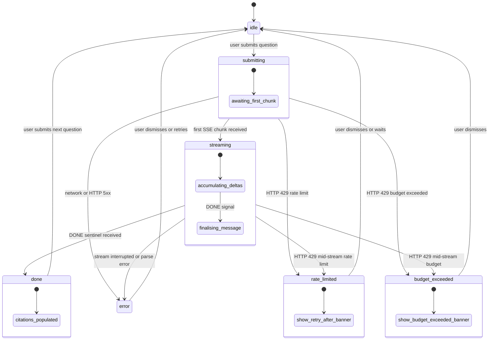

# Chat Request / Stream State Model

State machine for a single chat turn inside the frontend store/service.
Each state drives UI affordances (spinner, disabled composer, error banners, etc.).

```mermaid
stateDiagram-v2
    [*] --> idle

    idle --> submitting : user submits question

    submitting --> streaming : first SSE chunk received
    submitting --> error : network or HTTP 5xx
    submitting --> rate_limited : HTTP 429 rate limit
    submitting --> budget_exceeded : HTTP 429 budget exceeded

    streaming --> done : DONE sentinel received
    streaming --> error : stream interrupted or parse error
    streaming --> rate_limited : HTTP 429 mid-stream rate limit
    streaming --> budget_exceeded : HTTP 429 mid-stream budget

    done --> idle : user submits next question
    error --> idle : user dismisses or retries
    rate_limited --> idle : user dismisses or waits
    budget_exceeded --> idle : user dismisses

    state submitting {
        [*] --> awaiting_first_chunk
    }

    state streaming {
        [*] --> accumulating_deltas
        accumulating_deltas --> finalising_message : DONE signal
    }

    state done {
        [*] --> citations_populated
    }

    state rate_limited {
        [*] --> show_retry_after_banner
    }

    state budget_exceeded {
        [*] --> show_budget_exceeded_banner
    }
```
